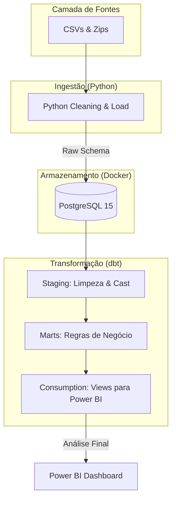

# 🛒 Olist E-commerce Data Pipeline: Da Ingestão ao Insight

Este projeto implementa uma solução completa de engenharia de dados (ELT) para transformar dados brutos de e-commerce em inteligência de negócio. Utilizamos uma stack moderna para responder: **"Por que atrasamos e quem são nossos clientes valiosos?"**

## 📖 Storytelling & Insights de Negócio

Em um mercado competitivo como o e-commerce, a experiência do cliente é definida por dois pilares: **pontualidade** e **valor**.

### 1. O Enigma do Atraso (Logística)
Não basta saber *que* atrasou, precisamos saber *onde*. 
- **Insight**: Através da nossa camada de consumo, identificamos a `Taxa de Atraso (%)` por estado. Isso permite que a equipe de logística renegocie contratos com transportadoras em regiões críticas ou ajuste as expectativas de entrega no checkout.

### 2. O Valor do Cliente (LTV & CRM)
Nem todo cliente é igual. Focar no CAC (Custo de Aquisição) sem olhar para o LTV (Lifetime Value) é um erro comum.
- **Insight**: Segmentamos os clientes em **High, Medium e Low Value**. 
    - **Ação**: Clientes 'High Value' (aqueles que gastam acima de R$ 500) devem receber ofertas exclusivas e atendimento prioritário para garantir a retenção.

---

## 🏗️ Arquitetura do Sistema



---

## 🚀 Como Executar (Automação Total)

Agora você pode rodar todo o pipeline com um único comando!

### Pré-requisitos
- Docker Desktop (Rodando)
- Python 3.9+

### Execução Rápida
1. Instale as dependências:
   ```bash
   pip install -r requirements.txt
   ```
2. Execute o script mestre:
   ```bash
   python run_pipeline.py
   ```

O script irá:
- Subir o container Docker.
- Esperar o banco ficar pronto (healthcheck).
- Executar a ingestão Python.
- Rodar todas as transformações e testes do dbt.

---

## 🛠️ Camada de Consumo (Power BI)

Criamos views otimizadas no schema `consumption` para facilitar a conexão com o Power BI:
- `view_delivery_analysis`: Gráficos de atraso por região e tempo médio de entrega.
- `view_customer_segments`: Dashboards de CRM e segmentação de valor.
- `mart_kpis`: Cartões de métricas rápidas (Faturamento, Ticket Médio, etc).

---

## ✅ Qualidade Garantida
Implementamos 3 níveis de testes:
1. **Schema Tests**: Garantia de unicidade e campos não nulos.
2. **Integrity Tests**: Verificação de dados órfãos (ex: pagamento sem pedido).
3. **Business Logic Tests**: Bloqueio de inconsistências (ex: entrega antes da data de compra).
## 🚀 Próximos Passos (Roadmap Avançado)

Para levar este projeto ao nível de uma plataforma de dados corporativa, as seguintes evoluções são recomendadas:

### 1. Orquestração e Agendamento
- **Ferramentas**: Implementar **Airflow**, **Prefect** ou **Dagster**.
- **Benefícios**: DAGs com dependências claras, retries automáticos controlados pelo orquestrador e agendamento inteligente.

### 2. Observabilidade e Monitoramento
- **Stack**: **Prometheus** + **Grafana** ou **Datadog**.
- **Métricas**: Alertas de falha em tempo real, tracking de SLA e dashboards de volumetria.

### 3. Governança e Qualidade
- **Data Contracts**: Implementar contratos de dados para garantir que mudanças na origem não quebrem o downstream.
- **SCD (Slowly Changing Dimensions)**: Evoluir a camada raw para um histórico `append-only` com suporte a versionamento de dados.

### 4. Engenharia de Performance
- **Carga Incremental**: Substituir o `TRUNCATE` por processos incrementais no dbt e na ingestão.
- **Particionamento**: Otimizar tabelas grandes (ex: `geolocation`) através de particionamento físico no PostgreSQL.

### 5. CI/CD e DevOps
- **Automação**: Pipelines no **GitHub Actions** para deploy automático e execução de testes de qualidade antes de cada merge em produção.
