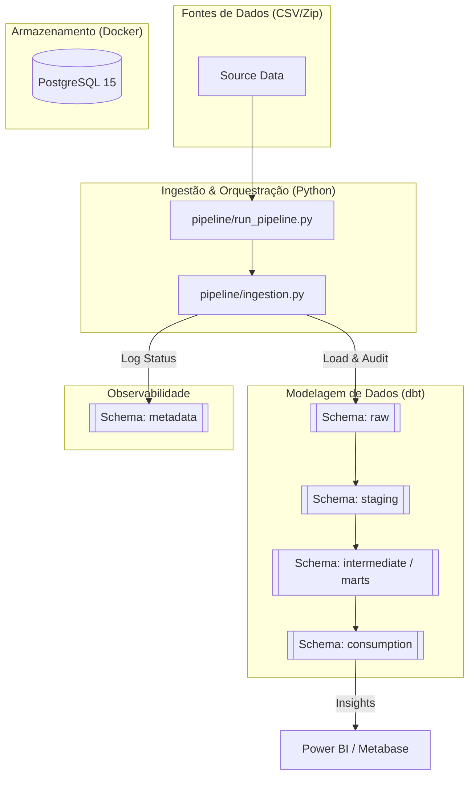

# 🛒 Olist E-commerce Data Pipeline

[](https://www.python.org/)
[](https://www.getdbt.com/)
[](https://www.postgresql.org/)
[](https://www.docker.com/)

Este repositório contém um pipeline de dados completo (ELT) que ingere, limpa e transforma os dados do dataset público da **Olist** (E-commerce brasileiro). O projeto foca em fornecer insights estratégicos sobre performance logística e segmentação de clientes através de uma arquitetura robusta e automatizada.

---

## 🏗️ Arquitetura Técnica

O projeto segue o padrão **ELT (Extract, Load, Transform)**, priorizando a transformação dentro do Data Warehouse (PostgreSQL) utilizando **dbt**.



---

## 🛠️ Stack Tecnológica

- **Linguagem**: Python 3.9+ (Ingestão e Orquestração)
- **Banco de Dados**: PostgreSQL 15 (Containerizado)
- **Transformação**: dbt (Data Build Tool)
- **Infraestrutura**: Docker & Docker Compose
- **Bibliotecas Python**: Pandas, SQLAlchemy, Psycopg2
- **Qualidade de Dados**: dbt Tests (Generic & Custom)

---

## 📂 Estrutura do Projeto

```text
.
├── data/                   # Arquivos CSV brutos (zipados ou extraídos)
├── dbt/                    # Projeto dbt (Modelos, Macros, Seeds)
│   ├── models/             # Camadas de modelagem (staging, marts, etc)
│   └── profiles.yml        # Configuração de conexão do dbt
├── infra/                  # Configurações de infraestrutura (Docker)
├── pipeline/               # Orquestração e Ingestão
│   ├── run_pipeline.py     # Script mestre de automação (Orquestrador)
│   ├── ingestion.py        # Script de carga resiliente
│   ├── utils.py            # Funções utilitárias (conexão, logging)
│   └── audit_setup.sql     # DDL para tabelas de auditoria
├── config/                 # Configurações globais e esquemas
├── docker-compose.yml      # Definição dos serviços (Postgres)
└── requirements.txt        # Dependências do projeto
```

---

## 📊 Modelagem de Dados & Camadas

O pipeline organiza os dados em esquemas lógicos para garantir governança e performance:

1.  **`raw` (Bronze)**: Dados exatamente como vieram da fonte. Tabelas truncadas e recarregadas a cada execução para garantir idempotência.
2.  **`staging` (Silver)**: Primeira camada de limpeza. Renomeação de colunas para padrão `snake_case`, cast de tipos (datas, valores numéricos) e deduplicação básica.
3.  **`intermediate / marts` (Silver/Gold)**: Aplicação de regras de negócio complexas, joins entre entidades (Pedidos + Itens + Clientes) e cálculos de KPIs.
4.  **`consumption` (Gold)**: Views otimizadas e prontas para consumo por ferramentas de BI. Focadas em:
    *   `view_delivery_analysis`: Taxas de atraso e performance logística por estado.
    *   `view_customer_segments`: Classificação de clientes (High/Medium/Low Value) baseada em RFM/LTV.
5.  **`metadata` (Audit)**: Camada de observabilidade que registra o status de cada job, tempo de execução e volumetria.

---

## 🔍 Observabilidade & Auditoria

Implementamos um sistema de logs estruturados na tabela `metadata.audit_jobs`. Cada etapa do pipeline registra:
- `job_name`: Nome da tarefa executada.
- `status`: SUCCESS ou FAILED.
- `duration_seconds`: Tempo total gasto.
- `rows_processed`: Quantidade de registros afetados.
- `error_message`: Stack trace em caso de falha.

---

## 🚀 Como Executar

### 1. Pré-requisitos
Certifique-se de ter instalado:
- Docker e Docker Compose
- Python 3.9+
- Ambiente Virtual (recomendado)

### 2. Configuração
Instale as dependências:
```powershell
pip install -r requirements.txt
```

### 3. Execução Total
O projeto conta com um orquestrador automatizado que gerencia o ciclo de vida completo:
```powershell
python -m pipeline.run_pipeline
```

**O que este comando faz?**
1.  Inicia o banco de dados via **Docker Compose**.
2.  Aguarda o **Healthcheck** do PostgreSQL (garante que o banco está pronto para conexões).
3.  Executa a **Ingestão Python**:
    *   Lê arquivos CSV/Zip da pasta `data/`.
    *   Cria schemas e tabelas de auditoria automaticamente.
    *   Carrega os dados para o schema `raw`.
4.  Executa as **Transformações dbt**:
    *   Compila e roda todos os modelos SQL.
    *   Executa os testes de qualidade (Primary keys, Not null, etc).

---

## ✅ Qualidade de Dados

Garantimos a integridade dos insights através de testes automatizados no dbt:
- **Schema Tests**: Validação de chaves primárias e campos obrigatórios.
- **Relationship Tests**: Garante integridade referencial (ex: todo item de pedido pertence a um pedido existente).
- **Business Logic Tests**: Testes customizados para validar datas (ex: entrega não pode ser anterior à compra).

---

## 📈 Insights de Negócio Gerados

*   **Logística**: Identificação de gargalos em estados específicos onde a `estimated_delivery_date` é frequentemente excedida.
*   **Marketing**: Lista de clientes "Champions" (High Value) para campanhas de fidelização personalizadas.
*   **Vendas**: Evolução mensal do faturamento e ticket médio por categoria de produto.

---

**Desenvolvido por [Antigravity AI]** para fins de demonstração de arquitetura de dados moderna.
